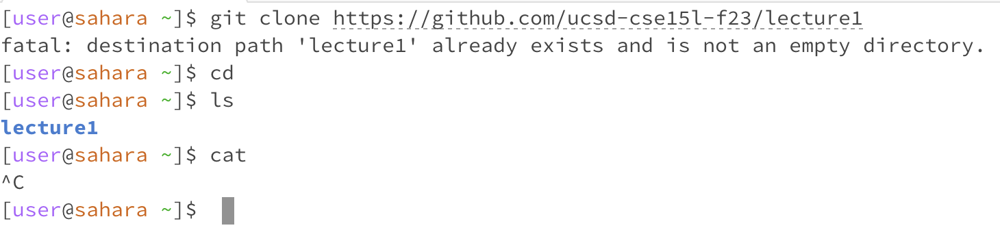
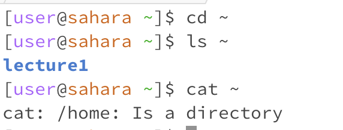

No Arguments

~(home directory)

cd: there was no other directories to move to
ls: lecture1 is in the current directory
cat: no other information was included after cat, so nothing showed up. 
cd: no error
ls: no error
cat: error, requires more information in order to work properly without being terminated.

Directory

cd: moved to directory, stayed the same
ls: lists lecture1 in the home directory
cat: tells us /home is the home directory
cd: no error
ls: no error
cat: no error

File

cd: the file is not a directory
ls: lists the Hello.java file
cat: reads what information was in Hello.java file
cd: no error
ls: no error
cat: no error

