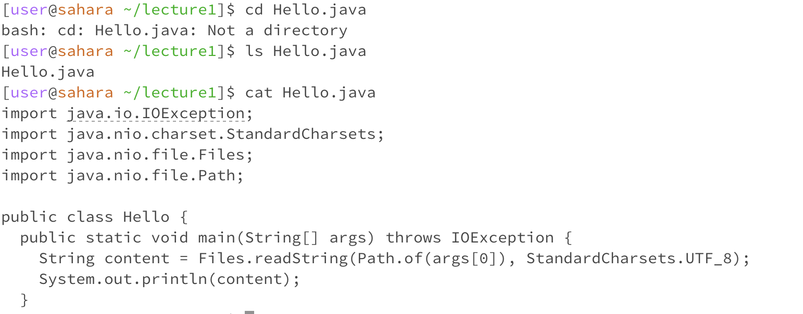

No Arguments

~(home directory)

cd: When typing cd into the terminal with no arguments with not directory, nothing happens as there is no unput. There is no error in the terminal but rather a human error because there is no directory to change to. 

ls: lecture1 is in the current directory

cat: no other information was included after cat, so nothing showed up.

cd: no error

ls: no error

cat: error, requires more information in order to work properly without being terminated.
In the Directory:

cd: moved to home directory, stayed the same

ls: lists lecture1 in the home directory

cat: tells us /home is the home directory

cd: no error

ls: no error

cat: There is an error because it is telling us the home is a directory which makes sense because the objectives of directories is to host other files that contains within them. It does not make sense to print the output of a directory that would list files. 

File

cd: the file is not a directory

ls: lists the Hello.java file

cat: reads what information was in Hello.java file

cd: This is an error because it indiates the README file is not a directory. README file is not a folder, but a txt file. The working directory in this case would be /home/lecture/README, thus there are no files we can access at the moment. 

ls: no error

cat: no error

