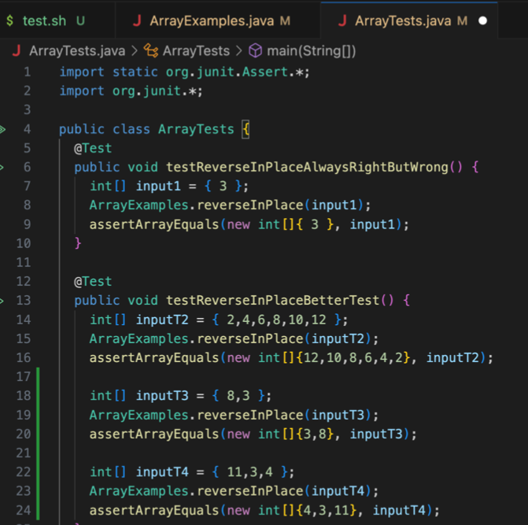

Part1 Code:
 

Messages:
 (https://0-0-0-0-3999-csbgek5n98f2l1ekk7gq5148do.us.edusercontent.com/add-messages?s=How%20are%20you)
- The method handleRequest and makeList is being called here
- A relevant argument in this case is url which represents the URL of the HTTP request. Values of relevant fields include "list" and "Ind". List represents the array of strings, which is used to store messages. Ind represents the index where the next message will be added to the list array.
- The values of the list array and the Ind field change as a result of this specific request. The "how are you" message is added to the list at the appropriate position, and Ind is updated to reflect the position for the next message.

 (https://0-0-0-0-3999-csbgek5n98f2l1ekk7gq5148do.us.edusercontent.com/add-messages?s=I%20like%20playing%20volleyball)
- The method handleRequest and makeList is being called here
- A relevant argument in this case is url which represents the URL of the HTTP request. Values of relevant fields include "list" and "Ind". List represents the array of strings, which is used to store messages. Ind represents the index where the next message will be added to the list array.
- the values of the list array and the Ind field change as a result of this specific request. The "i like playing volleyball" message is added to the list at the appropriate position, and Ind is updated to reflect the position for the next message.

Part 2:

Path to the private and public key:

Part 3:
In the week 2 and 3 lab, I learned how to create a webserver, whcih allows different methods that can be implemented into it. For example, you can add a message into the server and it would automatically run the method. Furthermore, I was not fully aware of hwo URl works, but fromt the labs I have a better understanding how URL works and that you cann methods into them. 
