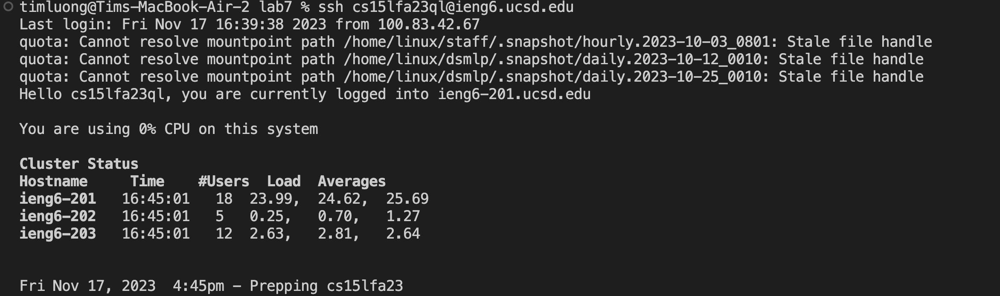

Lab Report 3
Part 1 
A failure-inducing input

An input that doesn't induce a failure

Symptom

The bug

 

Fixed code
 

The issue of the orignal code was that it was trying to reverse the array by iterating through it and replacing each element with the element at its corrsponding position from the end of the array. This will overwrite the orignal values before they can correctly move to their new and desired positions. Essentially, it results in the array losing the values that needs to be included and instead replace the values that have already been looped through. The corrected code includes a temporary array to store the values of the reversed array in order ot avoid the replacement of values and correctly reverses the list. 

Part 2

I chose to look moe at the command less. The less command shows the contents of the file passed as an argument one screen at a time. There are various options that can be used with this command, each of which modifies the output.

-N
-N=provides line numbers for lines in the files, which can help identify certain statements in .txt files. However, this command will only work on files.

Input:
 
Output:
 

Input

Using find -name with ./techincal:
find ./technical -name "*"
Output:
./technical/directory1/file1.txt
./technical/document.pdf
./technical/image.jpg
./technical/file.txt

find ./technical -name "reports*"
Output:
./technical/reportsHousing.txt
./technical/reports/
./technical/reportFromOneYearAgo.pdf

The usage of find -name would look through the enitre ./techincal directory for all the files and output of them. The find ./techincal  -name "reports" would look for all the files that are in the ./technical directory that have "reports" insde of the name of the path or file. This is more convenient for searching in a directory, so we don't have to manually search for a file we might want to use. 

 Source: https://linuxize.com/post/how-to-find-files-in-linux-using-the-command-line/ 

Using find -type with ./technical:
find ./technical -type f"
Output:
./technical/document.pdf
./technical/image.jpg
./technical/file.txt

find ./technical -type f -name "*.txt"
Output:
./technical/files1.txt
./technical/files2.txt
./technical/files3.txt

The usage would normally find all files that are within the technical directory. This helps us find files easier instead of focusing on a specific type. For example, in a .txt we can look for a .pdf as well. find ./technical -type f -name "*.txt" would help look for all .txt files in ./techincal which is convenient for finding a specific type of file. 

Source: https://linuxize.com/post/how-to-find-files-in-linux-using-the-command-line/ 

Using find -size with ./technical:
find ./technical -type f -size +100K
Output:
./technical/file1_largerThan100K
./technical/file2_largerThan100K
./technical/file3_largerThan100K
find ./technical -type d -size +1M
Output:
./technical/larger_then1M_directory1
./technical/larger_then1M_directory2
./technical/larger_then1M_directory3

The usage of find-size would normally look for all files that are approximately 100 kilobytes or larger while find -size with./technicall would look for all directories that are at least a megabyte. This would help sort out files that are either too small or too larger. 

Source: https://linuxize.com/post/how-to-find-files-in-linux-using-the-command-line/ 

Using find -regex with ./technical:
find ./technical -type f -regex ".*/file[0-4]"
Output:
./technical/file2
./technical/file3
find ./technical -type d regex ".*/playing[[:alpha:]]+"
Output:
./technical/playingCrazy
./technical/playingInClass
./technicalplayingWithFriends

The usage of find -regex would search for a file with a corresponding number if a specific range, which helps to find multiple occurrences of a file that belongs in a certain group. But we only want a certain index range. find-regex with ./technical: would find directories that include the word playing that also has at least one follow-up word. This is useful for finding a directory with more than one version of in the form of an ending term but a similiar start term. 

