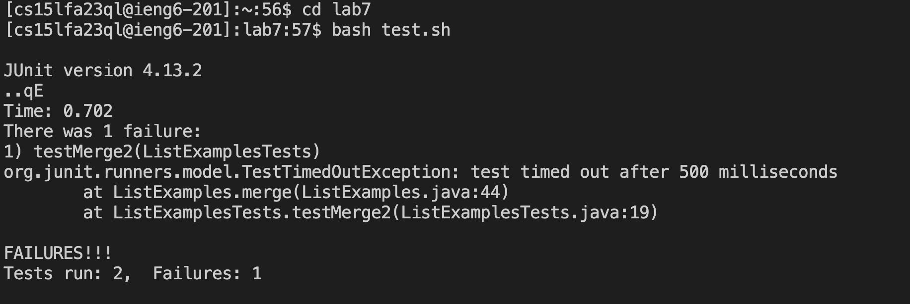
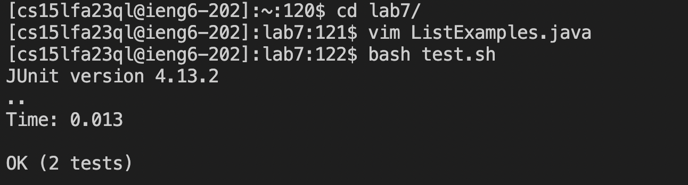

Lab Report 4

4. Log into ieng6

ssh cse15lfa23ql@ieng6.ucsd.edu <enter>

5. Clone your fork of the repository from your GIthub account

git clone https://github.com/ucsd-cse15l-s23/lab7 <enter>

6. Run the tests, demonstrating that they fail

bash test.sh <enter>

7. Edit the code file to fix the failing test
   
  
  
vim Li<tab>.java<enter>, 43j, 11k, x, i, 2, <esc>, :wq<enter>. Here, I decided not to type out the entirety of ListExamples, but instead  used tab to fill up the rest of the file name. After running the command I presed '43j' in order to move down 43 lines, then 11k to move right 11 indices, x to delete the 2, i and 2 to insert 2, and finally <esc> to exit out of the editing mode and :wq to save and quit out of vim.

8.Run the tests, demonstrating that they now succeed
 

 bash test.sh<enter>

9. Commit and push the resulting change to your GitHub account

git add Li<tab>.java<enter>. Used tab for the same reason as in step 7.
git commit Li<tab>.java -m "fixed bug"<enter>. Used tab for the same reason as in step 7, and decided to use the -m shortcut to include the message in the line to save time.
git push<enter>
