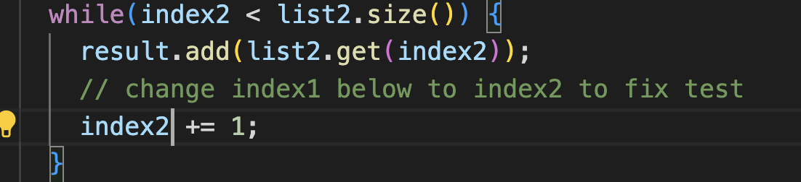

Lab Report 4

4. Log into ieng6

ssh cse15lfa23ql@ieng6.ucsd.edu <enter>

5. Clone your fork of the repository from your GIthub account

git clone https://github.com/ucsd-cse15l-s23/lab7 <enter>

6. Run the tests, demonstrating that they fail

bash test.sh <enter>

7. Edit the code file to fix the failing test
   
  
  
