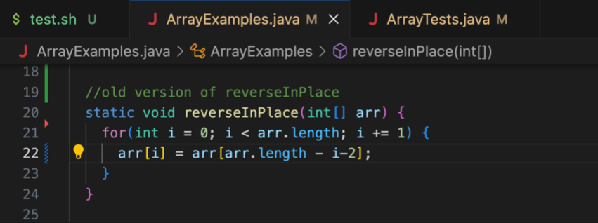
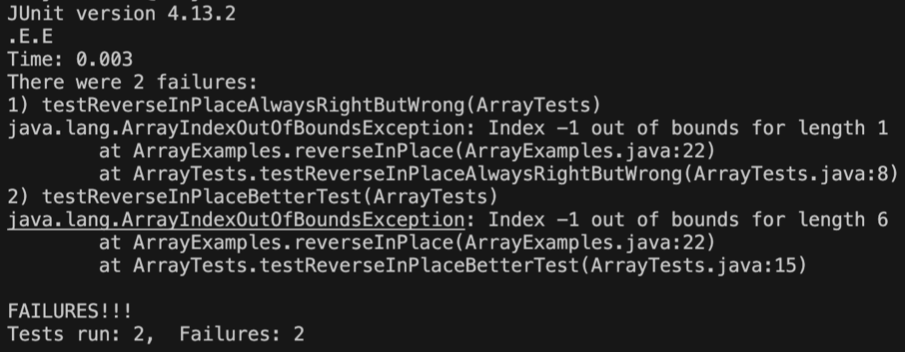
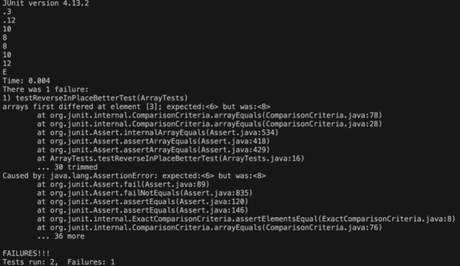
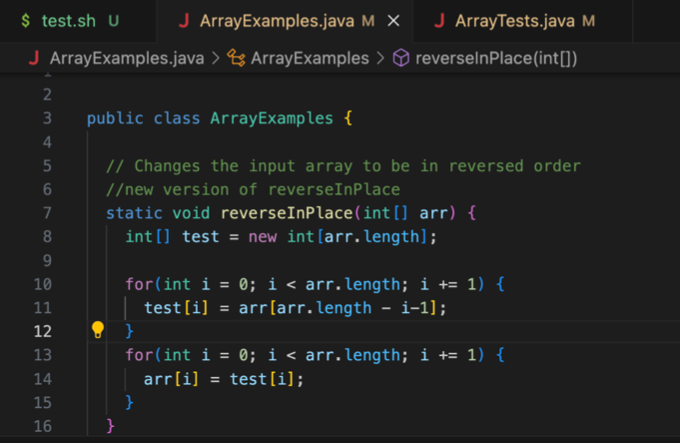
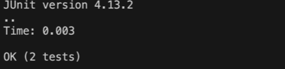
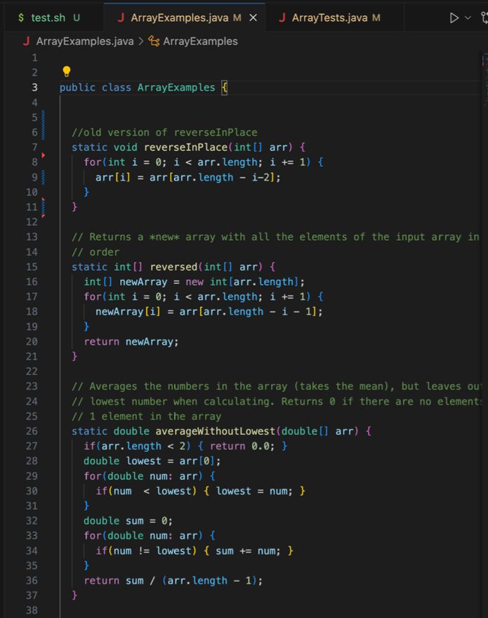
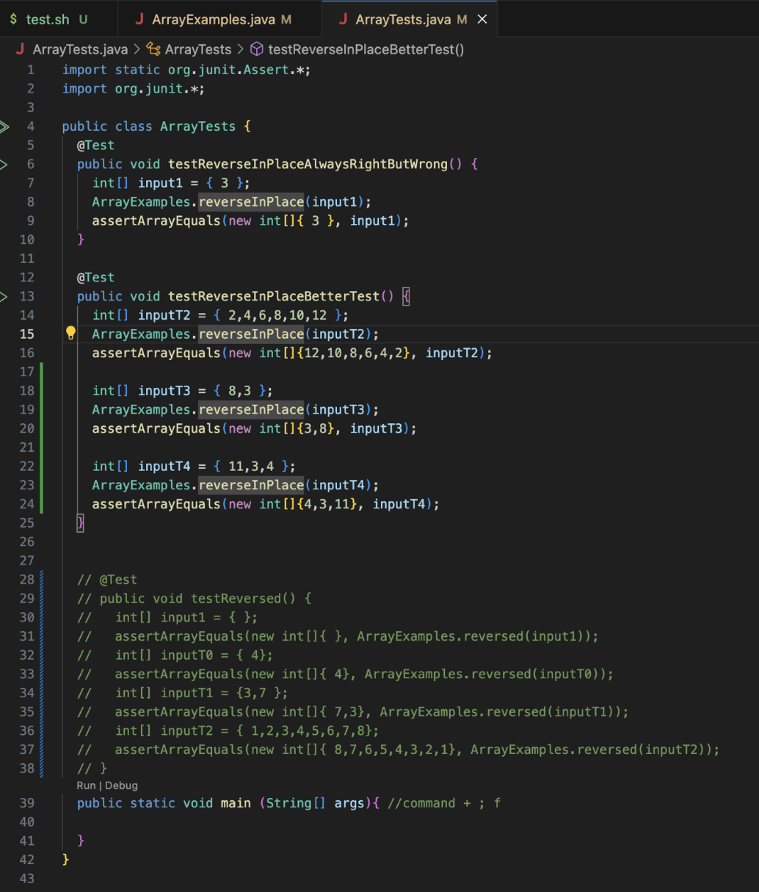

Lab Report 5
 
 
 
  1) Moriah: Hello! I am writing this post in order to get help on my week 4 lab report code. I have an error in ArrayExamples.java, specifically in the function reverseInPlace. I have an image of the symptoms and error of the code that I am testing. May I get any input in what is incorrect?

2) TA: Hello Moriah! After looking at your code, I can help you using your examples. I see that you have an array of {3,8} and that the expected output is {8,3}. Some questions that I would like you to think about is what the exact index are the elements 3 and 8. What is the length of the array? How would you find that position in the array? I would suggest using a for loop in order to iterate throught the code. I hope that helps and good luck!
3) Moriah: After testing, I discovered that the value 3 is actually in teh arr[0] index and 8 is ihe the 1 index. In order to get the last element, I would have to use length -1, sicne we have a length of 2. Instead of ``` length -i - 2 ``` , I used ``` length - i - 1 ``` in order to get the last element. Furthemore, there was an error with how my code is being iterated. In our example, {11,3,4}, we get an expected output {4,3,11}, which is completely incorrect. Thus, I used 2 arrays in order to add the changes to the temporary array and then move it back to the original array by using another loop. 

 
 
 
 Updated version:
 
 
 
4) file and directory structure: ArrayExampes.class, ListExamples.class,ArrayTests.class, Node.class, StringChecker.class, FileExample.class, LinkedList.class, LinkedListExample.java, ArrayExamples.java, ListExamples.java, FileExample.java, ArrayTests.java, test.sh

   files that changed: ArrayExamples.java




REFLECTION

Part 2
After a full quarter of Cse 15L, I learned a lot of things from the labs that we have done in class. One that really stood out to me was using the vim command to edit files. I realy enjoyed using vim to enable more efficient text editing and thought that it was fascinating. The skill demos were extremely useful when learning how to understand linux and code in general better.I really enjoyed the labs that we do in class and with our classmates and I definetly reccommend it to future students. 
