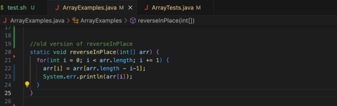

Lab Report 5
1) 
   Hello, I was wondering why am I getting this error. I assume that the bug was coming from testMerge2 which indicates that the merge function did not work for a specific test case. The error states that it timed out at line 44 which indicates that the error might be at that line. Am I on the right track?

2) Hello fellow student, you are on the right track and correct in thinking that the error is coming from testmerge2. The test that is not producing the exepcted output is from line 19 in ListExamples.java according to your symptom. You were also correct on stating that the error is coming from line 44. Good job and let me know if you have any more questions.
3)
4)
5)
6)
